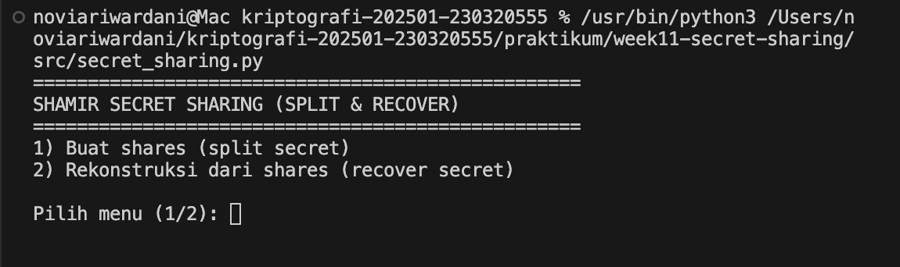

# Laporan Praktikum Kriptografi
Minggu ke-: 11  
Topik: [Secret Sharing (Shamir’s Secret Sharing)]  
Nama: [Novi Ari Wardani]  
NIM: [230320555]  
Kelas: [5DSRA]  


## 1. Tujuan
(Tuliskan tujuan pembelajaran praktikum sesuai modul.)

1. Menjelaskan konsep Shamir Secret Sharing (SSS).
2. Melakukan simulasi pembagian rahasia ke beberapa pihak menggunakan skema SSS.
3. Menganalisis keamanan skema distribusi rahasia.

## 2. Dasar Teori
(Ringkas teori relevan (cukup 2–3 paragraf).  

Shamir Secret Sharing (SSS) adalah skema kriptografi yang digunakan untuk membagi sebuah rahasia menjadi beberapa bagian dan mendistribusikannya kepada sejumlah pihak, dengan ketentuan bahwa rahasia tersebut hanya dapat diketahui kembali jika sejumlah bagian tertentu digabungkan. Setiap bagian rahasia yang dibagikan tidak memiliki arti sendiri dan tidak dapat digunakan untuk menebak rahasia utama. Dengan cara ini, tidak ada satu pihak pun yang memegang keseluruhan rahasia, sehingga risiko kebocoran dapat dikurangi.

Simulasi pembagian rahasia menggunakan skema SSS dilakukan dengan cara membentuk suatu fungsi matematika yang menyimpan rahasia di dalamnya, kemudian menghasilkan beberapa potongan rahasia yang dibagikan kepada pihak-pihak yang berbeda. Setiap pihak hanya menerima satu potongan rahasia, dan rahasia asli baru dapat dipulihkan ketika sejumlah potongan tersebut dikumpulkan dan diproses bersama. Proses ini menunjukkan bahwa pembagian rahasia dapat dilakukan secara aman tanpa harus mempercayakan rahasia penuh kepada satu pihak saja.

Keamanan skema Shamir Secret Sharing terjamin karena potongan rahasia yang jumlahnya tidak mencukupi tidak memberikan informasi apa pun tentang rahasia utama. Pihak yang tidak berwenang atau penyerang yang hanya memperoleh sebagian potongan rahasia tidak dapat mengetahui isi rahasia tersebut. Oleh karena itu, SSS sangat efektif untuk melindungi informasi penting dalam sistem terdistribusi dan meningkatkan keandalan serta keamanan penyimpanan rahasia.

## 3. Alat dan Bahan
(- Python 3.x  
- Visual Studio Code / editor lain  
- Git dan akun GitHub  


## 4. Langkah Percobaan
(Tuliskan langkah yang dilakukan sesuai instruksi.  
Contoh format:

Langkah 1 p implementasi shamir Secret Sharing 
    1. Buat forder kerja pretikum : 
        praktikum/week11-secret-sharing/
        ├─ src/
        ├─ screenshots/

    2. Buat file program utama : 
        src/secret_sharing.py

    3. Salin sources code SSS ke file tersebut (lihat bagian 5. Source Code)

    4. Jalankan program : 
        python src/secret_sharing.py

    5. Isi input saat diminta : 
        . secret (contoh: RAHASIA-TEST-123)
        . k (threshold, contoh: 3)
        . n (jumlah share, contoh: 5)

    6. Program akan: 
        . Membuat n shares (x, y)
        . Menampilkan shares di terminal (format hex untuk y)
        . Merekonstruksi secret memakai k shares pertama dan menampilkan hasilnya

    7. Ambil screenshot output terminal dan simpan di forder screenshots/ :
        . screenshots/input.png (bagian input)
        . screenshots/shares.png (bagian daftar shares)
        . screenshots/recover.png (bagian hasil rekonstruksi)

Langkah 2 - Simulasi Manual (Tanpa Library)

Parameter:

. Modulus prima: p = 2089
. Secret (a0) = 1234
. Threshold: k = 3 (derajat polinomial = 2)
. Jumlah shares: n = 5
. Koefisien acak (contoh): a1 = 166, a2 = 94

Polinimial:

. f(x) = a0 + a1·x + a2·x² (mod p)
. f(x) = 1234 + 166x + 94x² (mod 2089)

Hitung shares (contoh 5 titik)

Share1: x=1 → f(1)=1234+166+94=1494 (mod 2089)
Share2: x=2 → f(2)=1234+332+376=1942 (mod 2089)
Share3: x=3 → f(3)=1234+498+846=2578 ≡ 489 (mod 2089)
Share4: x=4 → f(4)=1234+664+1504=3402 ≡ 1313 (mod 2089)
Share5: x=5 → f(5)=1234+830+2350=4414 ≡ 236 (mod 2089)

Rekonstruksi dengan 3 shares (misal pakai x=1,2,3):

1. Ambil titik: (1,1494), (2,1942), (3,489)
2. Pakai Lagrange interpolation untuk mencari f(0) (y saat x=0), semuanya mod p.
3. Hasil akhirnya akan kembali ke a0 = 1234.

Langkah 3 - Analisis Keamanan

. Mengapa skema (k, n) aman meskipun sebagian share bocor?
    Karena < k shares tidak cukup untuk menentukan polinomial derajat (k−1) secara unik. Dengan shares yang kurang, masih ada banyak polinomial berbeda yang “cocok” dengan titik-titik tersebut, sehingga nilai f(0) (secret) bisa berubah-ubah dan tidak bisa dipastikan. Jadi share yang bocor sebagian hanya memberi informasi yang tidak cukup untuk membuka rahasia.

. Apa risiko jika threshold k terlalu kecil atau terlalu besar?
    - Jika k terlalu kecil: rahasia lebih mudah dipulihkan oleh pihak tidak berwenang (cukup kumpulkan sedikit share), sehingga keamanan menurun.
    - Jika k terlalu besar: pemulihan menjadi sulit saat kondisi darurat (butuh terlalu banyak pihak hadir), sehingga ketersediaan/availability menurun. Intinya, k adalah kompromi antara keamanan dan kemudahan recovery.

. Bagaimana penerapan SSS di dunia nyata (contoh: manajemen kunci cryptocurrency, recovery password)?
    SSS dipakai untuk membagi kunci master menjadi beberapa share yang disimpan di lokasi/orang berbeda, sehingga satu kebocoran tidak fatal. Contoh: manajemen kunci cryptocurrency (backup seed/private key) dengan skema 2-of-3 atau 3-of-5, atau recovery akses penting perusahaan di mana butuh beberapa admin menyetujui untuk membuka “master key”. Konsep yang sama juga cocok untuk recovery password/akun kritis: pengguna menyimpan share di perangkat berbeda atau orang tepercaya, lalu memulihkan akses hanya ketika threshold terpenuhi.


## 5. Source Code
(Salin kode program utama yang dibuat atau dimodifikasi.  
Gunakan blok kode:

```python
# contoh potongan kode
def encrypt(text, key):
    return ...
```
)

---

## 6. Hasil dan Pembahasan
(- Lampirkan screenshot hasil eksekusi program (taruh di folder `screenshots/`).  
- Berikan tabel atau ringkasan hasil uji jika diperlukan.  
- Jelaskan apakah hasil sesuai ekspektasi.  
- Bahas error (jika ada) dan solusinya. 

Hasil eksekusi program Caesar Cipher:




)

---

## 7. Jawaban Pertanyaan
(Jawab pertanyaan diskusi yang diberikan pada modul.  
- Pertanyaan 1: 
Keuntungan utama Shamir Secret Sharing adalah rahasia tidak pernah disimpan secara utuh oleh satu pihak. Setiap pihak hanya memegang sebagian informasi yang sendiri tidak memiliki arti. Jika satu pihak mengalami kebocoran atau disusupi, rahasia tetap aman. Skema ini mengurangi risiko kegagalan tunggal (single point of failure). Dengan demikian, tingkat keamanan jauh lebih tinggi dibanding membagikan salinan kunci secara langsung.

- Pertanyaan 2: 
Threshold (k) menentukan jumlah minimum share yang harus digabungkan untuk merekonstruksi rahasia. Nilai k menjadi batas utama yang melindungi rahasia dari akses tidak sah. Selama jumlah share yang dimiliki kurang dari k, rahasia tidak dapat diketahui sama sekali. Threshold juga mengatur tingkat toleransi terhadap kehilangan atau ketidaktersediaan pihak. Semakin tepat pemilihan k, semakin seimbang keamanan dan ketersediaan sistem.

- Pertanyaan 3:
Shamir Secret Sharing sangat bermanfaat dalam pengelolaan kunci dompet kripto. Kunci privat dapat dibagi ke beberapa orang atau perangkat dengan ambang tertentu. Transaksi hanya bisa dilakukan jika jumlah pihak minimum bekerja sama. Hal ini mencegah pencurian dana oleh satu pihak saja. Selain itu, kehilangan satu share tidak langsung menyebabkan kehilangan akses ke aset.

)
---

## 8. Kesimpulan
(Tuliskan kesimpulan singkat (2–3 kalimat) berdasarkan percobaan.  )

Kesimpulannya, Shamir Secret Sharing merupakan metode yang efektif untuk membagi dan menjaga kerahasiaan suatu informasi tanpa menyimpannya secara utuh pada satu pihak. Rahasia hanya dapat direkonstruksi apabila jumlah share yang dikumpulkan memenuhi threshold yang telah ditentukan. Skema ini memiliki tingkat keamanan yang tinggi dan cocok diterapkan pada sistem yang membutuhkan kepercayaan dan keamanan terdistribusi.
## 9. Daftar Pustaka
(Cantumkan referensi yang digunakan.  
Contoh:  
- Katz, J., & Lindell, Y. *Introduction to Modern Cryptography*.  
- Stallings, W. *Cryptography and Network Security*.  )

---

## 10. Commit Log
(Tuliskan bukti commit Git yang relevan.  
Contoh:
```
commit week11 Secret Sharing (Shamir’s Secret Sharing)
Author: Novi Ari Wardani <wardani101103@gmail.com>
Date:   2025-12-30

   week11 Secret Sharing (Shamir’s Secret Sharing) )
```
